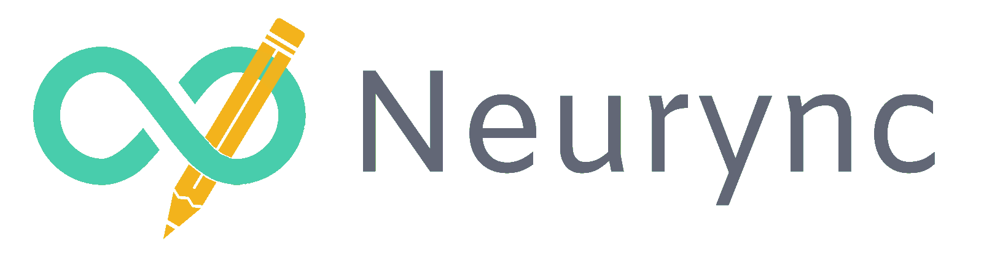

# ♾️ Neurync

## 📄 Sumário 
- [⚙️ Servidor](https://github.com/Neurync/neurync-server)
- [📱 Aplicativo](https://github.com/Neurync/neurync-mobile)

## ℹ️ Sobre
O Neurync consiste em em um conjunto de sistemas com o objetivo de auxiliar neurodivergentes no contexto escolar.

## 🧑‍💻 Autores
- [Rafael Santiago da Silva](https://github.com/rafaelsantiagosilva)
- [Heloísa Fernandes Cano](https://github.com/helocano)
- [Lucas Tompson Oliveira](https://github.com/lucas-tompson)
- [Henry Lucas Antunes](https://github.com/02daDeepWeb)
- [Renato Florencio](https://github.com/Renato-Florencio2)
